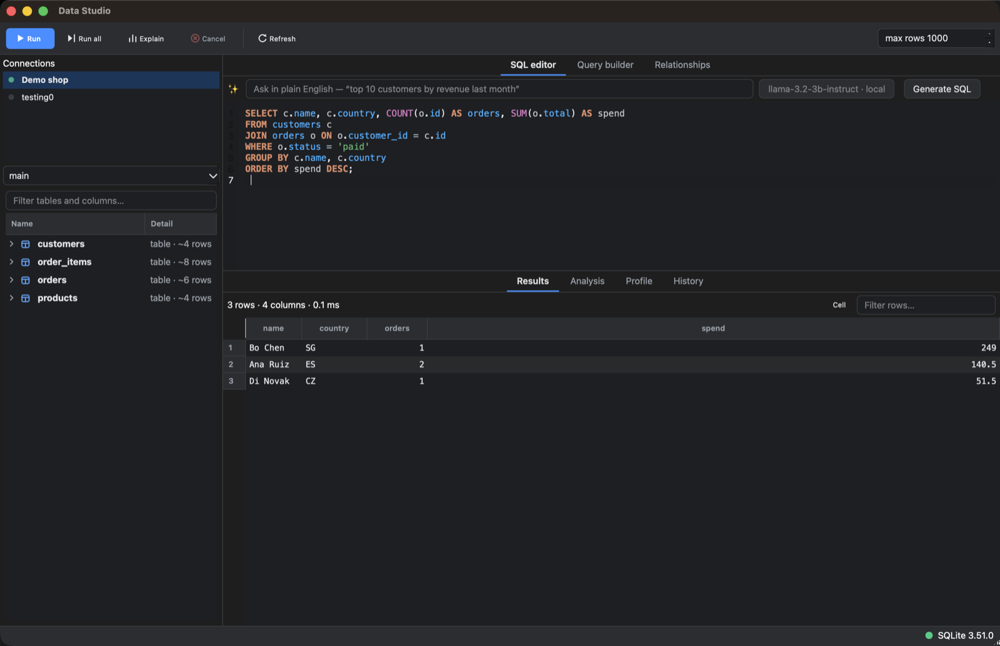
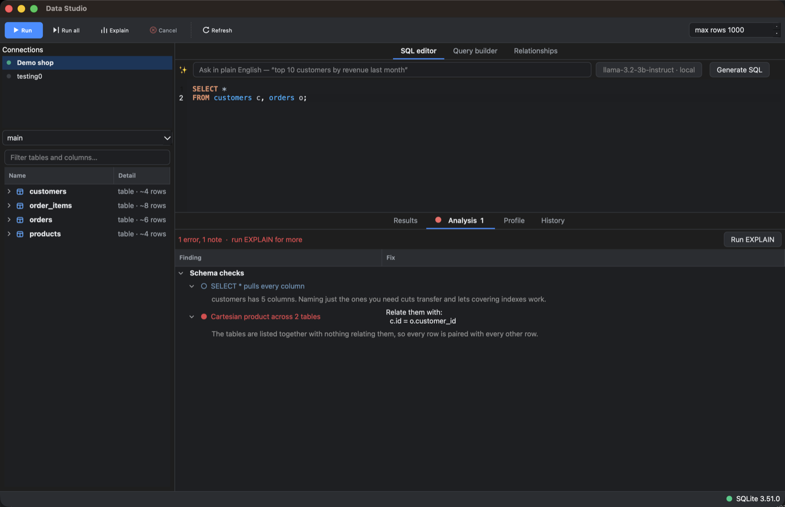
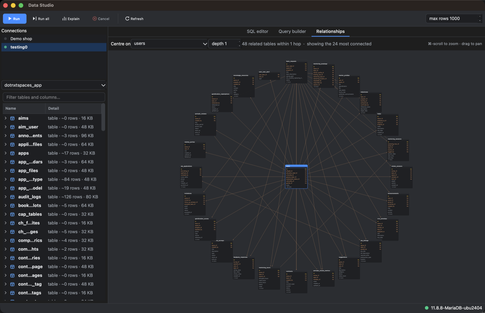
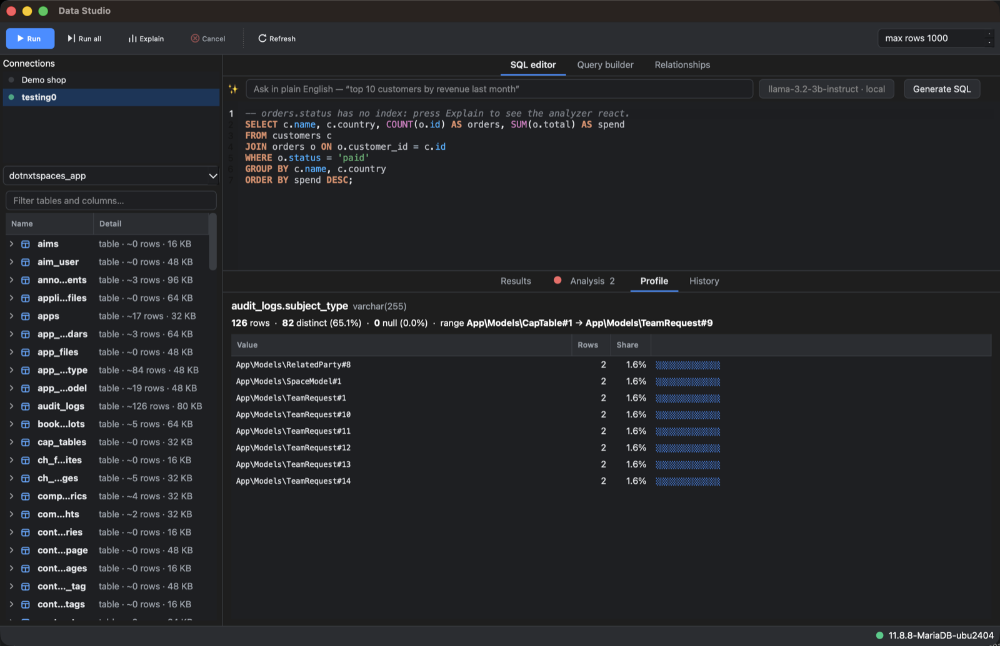
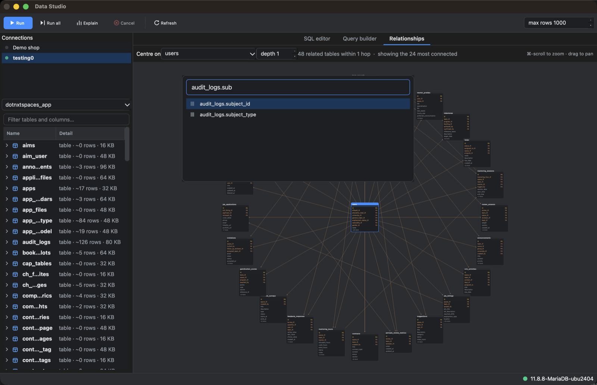

# Data Studio

**A native desktop SQL client that reads your schema and uses it.**

`v0.1` · macOS · C++20 + Qt 6 · SQLite, MySQL and MariaDB

Most database clients treat your schema as a list of names to autocomplete. Data Studio
treats it as the thing that should be doing the work: completion knows which table you
are in, joins are generated from real foreign keys, queries are checked against real
indexes before you run them, and the shape of an unfamiliar database is something you
can look at rather than reconstruct in your head.

It runs natural-language SQL against a **local model** — nothing leaves the machine —
or the Claude API, whichever you configure. Neither is required; without one, everything
else works unchanged.

---

## What it looks like

### Write a query, read the result



Line-numbered editor with schema-aware highlighting — identifiers that exist in the
connected database are coloured differently from ones that don't, so a typo shows up
before you run anything. `⌘↩` runs the statement under the cursor. The grid reports rows,
columns and elapsed time, and keeps the ordering your `ORDER BY` asked for.

### The analyzer tells you what's wrong before the server does



Two layers. Static rules check the statement against the schema with no round trip:
unknown tables and columns, `UPDATE`/`DELETE` with no `WHERE`, predicates that can't use
an index (`DATE(created_at) = …`, `LIKE '%foo'`), unindexed join columns, numeric-vs-string
comparisons that silently defeat an index. Then `EXPLAIN` findings layer on top: full
scans, filesorts, temporary tables, block nested-loop joins.

Above, it has spotted a Cartesian product and worked out the missing join condition —
`c.id = o.customer_id` — from the foreign key. Findings that have a fix carry runnable
SQL you can insert with a double-click.

### See the shape of the database



An interactive map of the foreign-key graph. A large schema can't be drawn at once and
stay readable, so it works in focus mode: one table at the centre, everything within *N*
hops in rings around it, sized so nodes never overlap. Past 24 neighbours it keeps the
most connected ones and says how many it left out.

That is a real 151-table application schema. `users` is at the centre; the ring is the
24 most connected of its 48 direct relations. Each node lists its keys and relationships
first. `⌘`-scroll zooms, drag pans.

### Ask what a column actually contains



Row count, nulls, distinct values, range, mean, and the most common values with
proportion bars — then what that implies. A column that is effectively constant, one
that is unique but unindexed, or a value that accounts for most of the table (so a
filter matching it reads nearly everything, while one matching anything else is highly
selective). Right-click a frequent value to drop it into the editor as a `WHERE`
condition.

### Get anywhere with `⌘K`



Fuzzy search over every table, every column and every command. On a schema with hundreds
of tables it is the fastest way to get anywhere. Choosing a table centres the diagram and
previews it; choosing a column profiles it.

---

## Local models

Natural-language SQL runs against any OpenAI-compatible server — **LM Studio, Ollama,
llama.cpp, vLLM, mlx_lm**. Press **Detect** in *Query ▸ AI settings…* and it probes the
usual ports (1234, 11434, 8080, 8000) and lists the models each is serving. **Test** makes
a real round trip against a throwaway schema.

Only schema metadata is ever sent — names, types, keys, indexes. **No row data leaves the
machine**, under either provider.

### Small models are enough — measured

Both of these are 3B instruction models answering *"total spend per customer for paid
orders, highest first"* against a two-table schema, on an M-series MacBook via LM Studio:

| Model | Params | `json_schema` | Latency | Result |
|---|---|---|---|---|
| `llama-3.2-3b-instruct` | 3B | honoured | 2.3 s | correct SQL |
| `mistralai/ministral-3-3b` | 3B | honoured | 2.7 s | correct SQL |

Both produced a correct join through the foreign key, the right aggregate, and the right
ordering. A 7B coding model (`qwen2.5:7b-instruct` under Ollama) does better on
multi-table joins; a 3B is genuinely fine for everyday questions.

Two things make that work:

**Schema pruning.** A 3B model has a small context window. Above the *schema limit*
setting (25 tables by default) only the tables relevant to the question are sent, plus
their foreign-key neighbours so the joins stay expressible. On the 151-table schema
pictured above:

| Prompt | Size | Tokens | Tables |
|---|---|---|---|
| Every table | 83 KB | ~21,300 | 151 |
| Pruned, default budget | 12 KB | ~3,200 | 25 |

That is the difference between not fitting and fitting comfortably. Set the limit to 0 to
always send everything.

**Tolerant parsing.** The request asks for a JSON schema, which LM Studio and vLLM honour.
When a model ignores it the reply is still recovered: markdown fences stripped, JSON
extracted from surrounding prose, unescaped newlines inside string values repaired, and
failing all that a bare `sql` block or statement lifted out. A `destructive` flag the
model understated is re-derived from the SQL itself.

This is not hypothetical — without a schema, `ministral-3-3b` returns fenced markdown with
literal newlines inside JSON string values, which is invalid JSON. Every case in the
parser's test suite is a reply shape one of these models actually produced.

### Claude API

Set `ANTHROPIC_API_KEY`, or paste a key into the same dialog to store it in the Keychain.
Requests use `claude-opus-5` with structured outputs, so the response is a validated
object rather than prose to be scraped.

Under both providers the generated SQL is inserted into the editor with its explanation as
a comment and the provider named — it is **never run automatically** — and statements that
write data are flagged before you run them.

---

## Building

Requires macOS, CMake ≥ 3.21, and a C++20 compiler.

```sh
brew install qt sqlite mariadb-connector-c
cmake -S . -B build -DCMAKE_BUILD_TYPE=Release
cmake --build build
open build/data-studio.app
```

**Use MariaDB Connector/C, not Oracle's `mysql-client`.** MySQL 9 removed the client-side
`mysql_native_password` plugin, and that is still MariaDB's default authentication method,
so an Oracle-client build cannot connect to a MariaDB server at all:

```
Authentication plugin 'mysql_native_password' cannot be loaded:
  .../lib/plugin/mysql_native_password.so (no such file)
```

Connector/C ships that plugin *and* `caching_sha2_password`, so one build talks to both
engines. The two libraries expose the same `mysql.h` API; CMake prefers Connector/C, falls
back to `libmysqlclient` with a warning, and produces SQLite-only binaries if neither is
present.

### Trying it out

```sh
sqlite3 demo.db < examples/demo.sql
```

Add `demo.db` as a SQLite connection. `orders.status` is deliberately left unindexed, so
`SELECT * FROM orders WHERE status = 'paid'` gives the analyzer something to say.

### Tests

```sh
cd build && ctest -V
```

`core` exercises the drivers, introspection and query intelligence against a throwaway
SQLite database — including a round trip proving a suggested `CREATE INDEX` actually
removes the finding and changes the query plan. `ui` covers the threaded session, the
results model's CSV/`INSERT` exports, the editor, the model-reply parser and schema
pruning, headless via Qt's offscreen platform plugin.

Set `DS_TEST_MYSQL` to also run against a live server — worth doing against both engines,
since they disagree about the SQL type of several `information_schema` expressions:

```sh
DS_TEST_MYSQL="127.0.0.1:3306:root:secret" ./build/ds-core-tests
DS_TEST_MYSQL="127.0.0.1:3306:root:secret" QT_QPA_PLATFORM=offscreen ./build/ds-ui-tests
```

---

## Architecture

Two libraries and a thin executable, so the interesting logic is testable without a GUI.

```
src/
  core/          dscore — no Qt at all
    Value.h        cell values (std::variant), ResultSet, DbError, Dialect
    Schema.h       Table / Column / Index / ForeignKey, type classification
    Driver.h       the driver interface + statement splitter
    sqlite/        SqliteDriver   — sqlite3 C API
    mysql/         MySqlDriver    — MariaDB Connector/C or libmysqlclient
  query/         dscore — schema-driven query intelligence
    SqlLexer       tokenizer shared by the highlighter and everything below
    SqlContext     what is the caret in? which tables are in scope? completion
    JoinGraph      FK graph, shortest join path, multi-table join planning
    QueryBuilder   QuerySpec -> SQL (pure; no database access)
    Analyzer       static schema rules + EXPLAIN interpretation
    Profile        column statistics: the queries, and what they imply
  ai/            dsui
    SqlGenerator   provider interface + the tolerant model-reply parser
    SchemaPrompt   schema -> DDL prompt, with relevance pruning for small models
    LocalSqlGenerator   any OpenAI-compatible server
    ClaudeSqlGenerator  Claude Messages API, structured outputs
    AiSettings     provider config + local-server discovery
  ui/            dsui
    QueryExecutor  ConnectionSession: driver on a worker thread, queued signals
    DiagramView    QGraphicsScene map of the FK graph, radial focus layout
    ProfilePanel   column statistics and the insights drawn from them
    CommandPalette ⌘K fuzzy launcher over schema and commands
    HistoryPanel   persisted, searchable query history
    Theme          palette, painted icons, application stylesheet
    MainWindow, SqlEditor, SchemaTree, ResultsView, AnalyzerPanel, …
tests/           core_tests.cpp, ui_tests.cpp
```

Nothing in the diagram, the palette or profiling needs a schema described by hand: all
three are driven by the same introspected `Schema` and `JoinGraph` that power completion
and the analyzer.

### Notes on some decisions

**Drivers are written directly against `sqlite3` and the MySQL client rather than Qt SQL.**
Homebrew's Qt ships only the SQLite plugin — there is no `QMYSQL` — and going native also
buys real query cancellation, streaming result reads, and full control over introspection.

**`dscore` has no Qt dependency.** Values are a `std::variant`, not `QVariant`, so the whole
query-intelligence layer is plain C++ and testable on its own.

**Queries run on a per-connection worker thread.** `ConnectionSession` owns the thread and
forwards calls as queued invocations; results come back as signals. `cancel()` is the single
documented cross-thread entry point — SQLite uses `sqlite3_interrupt`, MySQL opens a second
connection and issues `KILL QUERY`, which is what the `mysql` CLI does for Ctrl-C.

**MySQL reads results with `mysql_use_result`,** streaming rather than buffering, so a stray
`SELECT *` on a huge table hits the row cap instead of exhausting memory. `DECIMAL` is
deliberately kept as text — converting it to `double` would throw away the precision the
column type exists to provide.

**Server-reported metadata is read with coercing accessors, never `std::get`.** Which SQL
type a server reports for an expression is not something a client can rely on: MariaDB
returns `COALESCE(data_length + index_length, -1)` as DECIMAL. Assuming a variant
alternative there threw `bad_variant_access` on every MariaDB schema.

**The connection handle is stored as `void*`.** Oracle's client declares `struct MYSQL`
while Connector/C declares `struct st_mysql`, so no forward declaration compiles against
both.

**Introspection is one query per metadata kind, not per table.** On a schema with a few
hundred tables the per-table version takes seconds.

**Passwords go to the macOS Keychain,** never to the preferences file.

### Interface

Colours, metrics and icons live in `src/ui/Theme.cpp` and are derived from the system
palette, so light and dark both work and no widget hard-codes a hex value at the call site.
Icons are painted with `QPainter`, so the app ships no image assets.

---

## Keyboard

| | |
|---|---|
| `⌘K` | Go to any table, column or command |
| `⌘↩` | Run the statement under the cursor |
| `⇧⌘↩` | Run the whole script |
| `⌘E` | `EXPLAIN` the current statement |
| `⌘.` | Cancel the running query |
| `⌃Space` | Completions |
| `⇧⌘F` | Format the statement onto one clause per line |
| `F5` | Refresh schema |

---

## Status

Everything above works and is covered by the test suite — 138 assertions across two
suites, plus live-server sections verified against MariaDB 11.8.8 and MySQL 8.0.46.

Known gaps in v0.1:

- Result grids are read-only; there is no in-place row editing.
- Export is clipboard only (TSV, CSV, `INSERT` statements) — no export to file yet.
- The relationship diagram is read-only. `JoinGraph::shortestPath` already computes the
  join, so dragging between two tables to generate it is the obvious next step.
- Only macOS has been exercised. The Keychain code is `#ifdef`'d and degrades to
  "don't save passwords" elsewhere.
